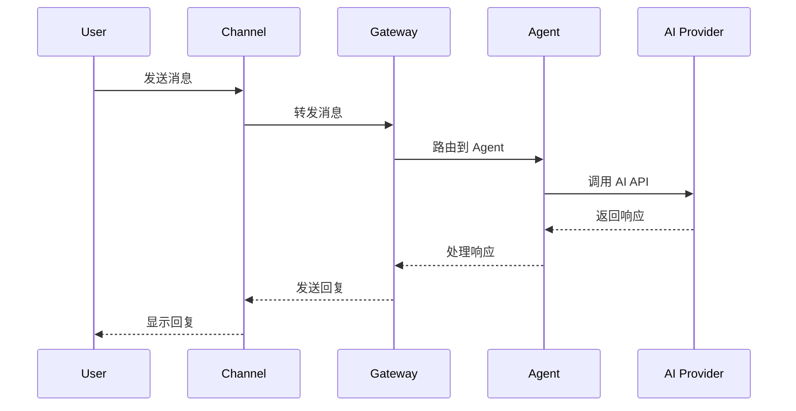

# OpenClaw 技术科普文档计划

## 目标读者
- 有一定编程经验的开发者
- 对 AI 应用开发感兴趣的程序员
- 想要贡献或扩展 OpenClaw 的开发者

## 文档结构

### 1. 项目概览 (`01-overview.md`)
**内容:**
- OpenClaw 是什么？解决什么问题？
- 核心价值：一个 AI 助手，多个聊天平台
- 架构全景图（ASCII 或 Mermaid 图）
- 技术栈概览：TypeScript/ESM、Node.js 22+、Bun、Commander.js、WebSocket

**关键点:**
```
用户消息 → [WhatsApp/Telegram/Discord/...] → OpenClaw Gateway → AI Agent → 响应
```

---

### 2. 核心概念 (`02-core-concepts.md`)
**内容:**
- **Channel（渠道）**: 消息平台的抽象层
- **Agent（智能体）**: AI 执行单元，管理对话和工具
- **Gateway（网关）**: WebSocket 服务器，协调一切
- **Session（会话）**: 对话状态管理
- **Plugin（插件）**: 扩展机制

**代码示例:**
- Channel 的接口定义
- Agent 配置示例
- Session key 编码规则

---

### 3. 消息流详解 (`03-message-flow.md`)
**内容:**
- 入站消息流程（以 Telegram 为例）
  1. Bot 收到消息
  2. 解析为标准格式
  3. 路由到 Agent
  4. 加载会话
  5. 调用 AI
- 出站消息流程
  1. AI 生成响应
  2. 文本分块（根据平台限制）
  3. 通过 Channel 发送
- 工具调用流程

**图示:**


---

### 4. Channel 系统深度解析 (`04-channel-system.md`)
**内容:**
- Channel 抽象设计
- ChannelPlugin 接口详解
  - `ChannelConfigAdapter`: 账户管理
  - `ChannelOutboundAdapter`: 消息发送
  - `ChannelGatewayAdapter`: 实时接收
  - `ChannelSecurityAdapter`: 权限检查
  - `ChannelGroupAdapter`: 群聊行为
  - `ChannelMentionAdapter`: @提及处理
  - `ChannelThreadingAdapter`: 线程/回复
- Channel Registry：元数据管理
- 内置 Channel vs 扩展 Channel

**代码走读:**
- `src/channels/plugins/types.ts`
- `src/channels/registry.ts`
- `src/telegram/channel.ts`（示例实现）

---

### 5. Agent 系统深度解析 (`05-agent-system.md`)
**内容:**
- Agent 是什么？
- Agent 配置与作用域
- 两种执行模式：
  - Embedded Pi（直接调用 Anthropic SDK）
  - CLI Runner（调用外部 CLI）
- Session 管理
  - Session Key 编码：`agent:agent-id:session-key`
  - 会话持久化
  - 历史记录管理
- 工具系统（Agent Tools）

**代码走读:**
- `src/agents/agent-scope.ts`
- `src/agents/pi-embedded.ts`
- `src/config/sessions.ts`

---

### 6. Gateway 架构 (`06-gateway-architecture.md`)
**内容:**
- Gateway 的角色
- WebSocket 服务器设计
- 认证与授权
  - Token/Password 认证
  - 角色：operator, node
  - 权限作用域：admin, read, write, approvals, pairing
- RPC 方法（server-methods）
  - agent.* - 智能体操作
  - chat.* - 聊天管理
  - channels.* - 渠道状态
  - config.* - 配置更新
  - sessions.* - 会话管理
- 广播与事件系统

**代码走读:**
- `src/gateway/server.ts`
- `src/gateway/server-methods/`

---

### 7. 插件系统 (`07-plugin-system.md`)
**内容:**
- 插件类型
  - Channel Plugin（渠道插件）
  - Tool Plugin（工具插件）
  - Hook Plugin（钩子插件）
  - Provider Plugin（模型提供者）
  - HTTP Handler（HTTP 端点）
  - CLI Command（CLI 命令）
- Plugin Registry 单例模式
- Plugin SDK 公开 API
- 开发一个插件的步骤

**代码走读:**
- `src/plugins/registry.ts`
- `src/plugin-sdk/index.ts`
- `extensions/discord/` 作为示例

---

### 8. 配置系统 (`08-configuration.md`)
**内容:**
- 配置文件位置：`~/.openclaw/openclaw.json`
- 配置结构总览
- Zod Schema 验证
- 热重载机制
- 各模块配置详解
  - agents 配置
  - channels 配置
  - gateway 配置
  - hooks 配置
  - tools 配置

**代码走读:**
- `src/config/config.ts`
- `src/config/types.ts`

---

### 9. 设计模式与最佳实践 (`09-design-patterns.md`)
**内容:**
- **依赖注入**: `createDefaultDeps()` 模式
- **适配器模式**: Channel 适配器设计
- **注册表模式**: Plugin Registry 全局单例
- **会话编码**: Session Key 设计
- **错误处理**: 自定义错误类型
- **文件组织**: 代码结构约定
- **测试策略**: 单元/集成/E2E/Live

---

### 10. 实战：添加一个新 Channel (`10-tutorial-new-channel.md`)
**内容:**
- 需求分析
- 创建 extension 目录结构
- 实现 ChannelPlugin 接口
- 编写配置 Schema
- 测试与调试
- 注册到系统

**完整代码示例:**
- 一个简化的 "Echo Channel" 实现

---

## 附录

### A. 术语表 (`glossary.md`)
- Channel, Agent, Gateway, Session, Plugin, Hook, Provider 等

### B. 文件索引 (`file-index.md`)
- 关键文件路径与职责说明

### C. API 参考 (`api-reference.md`)
- Gateway RPC 方法列表
- Plugin SDK 导出类型

---

## 写作原则

1. **由浅入深**: 先概念，后实现
2. **代码优先**: 每个概念都配合实际代码
3. **图文并茂**: 使用 Mermaid 图展示流程
4. **中英对照**: 关键术语保留英文，便于查阅源码
5. **可运行示例**: 示例代码应该能实际运行

## 预计产出

- 10 篇核心文档
- 3 篇附录
- 约 15,000-20,000 字
- 5-10 个 Mermaid 流程图

## 时间安排建议

| 阶段 | 内容 |
|------|------|
| Phase 1 | 01-03 概览与消息流 |
| Phase 2 | 04-06 Channel/Agent/Gateway |
| Phase 3 | 07-08 插件与配置 |
| Phase 4 | 09-10 设计模式与实战 |
| Phase 5 | 附录与审校 |
